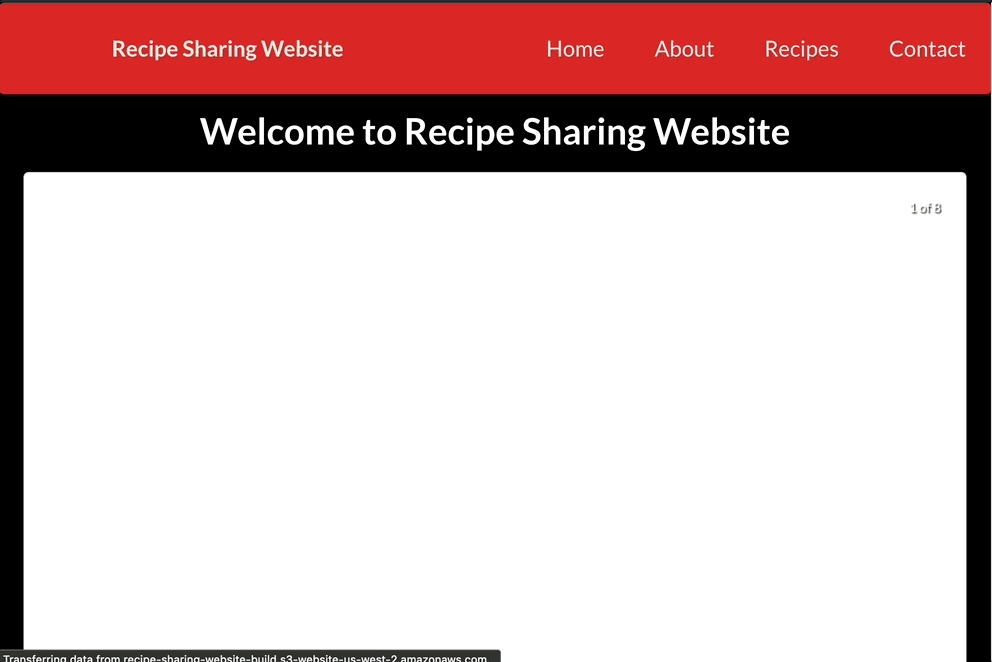

# Recipe Sharing Website

## Overview

Recipe Sharing Website is a full-stack web application that allows users to share and discover recipes. The application has a React frontend and a Django backend, enabling users to browse recipes, add new ones, and interact with the database through a RESTful API.

## Demo


## Frontend Components

- **Home.js:** Welcome page with a carousel of images.
- **About.js:** Images and Text
- **Recipes.js:** Displays a list of recipes fetched from the backend, with options to add new recipes.
  - **Add Recipe form:** A form to add new recipes, which sends data to the backend.
- **Contact.js:** Contact form for users to reach out (currently not set up for user interaction)


## Installation and Setup

### Prerequisites

- **Node.js** (version 14 or higher)
- **npm** Node Package Manager
- **Python** (version 3.6 or higher)
- **Django** (version 3.2 or higher)

Ensure you have Node.js, npm, Python, and Django installed on your system. You can download Node.js and npm from the [Node.js official website](https://nodejs.org/en) and Python from the [Python official website](https://www.python.org/).

### Setting Up the Project

1. **Clone the repository:**

  ```
  git clone https://github.com/reshmar00/recipe-sharing-website.git
  cd recipe-sharing-website
  ```

#### Setting Up the Frontend

2. **Navigate to the frontend directory:**
  ```
  cd frontend
  ```

3. **Install dependencies**
  ```
  npm install
  ```

  Here are is what I used:
  ```
  frontend@0.1.0 /Users/reshmaraghavan/recipe-sharing-website/frontend
  ├── @babel/plugin-transform-private-property-in-object@7.24.7
  ├── @rollup/plugin-terser@0.4.4
  ├── @testing-library/jest-dom@5.17.0
  ├── @testing-library/react@13.4.0
  ├── @testing-library/user-event@13.5.0
  ├── axios@1.7.2
  ├── google-fonts@1.0.0
  ├── lru-cache@11.0.0
  ├── nth-check@2.0.1
  ├── react-dom@18.3.1
  ├── react-responsive-carousel@3.2.23
  ├── react-router-dom@6.24.1
  ├── react-scripts@5.0.0
  ├── react@18.3.1
  ├── rimraf@6.0.1
  ├── semantic-ui-css@2.5.0
  ├── semantic-ui-react@2.1.5
  └── web-vitals@2.1.4
  ```

4. **Start the React development server:**
  ```
  npm run build
  npm run start
  ```

5. **Open your browser and navigate to:**
  ```
  http://localhost:3000
  ```

#### Setting Up the Backend

6. **Navigate to the backend directory:**
  ```
  cd backend
  ```

7. **Create a virtual environment:**
  ```
  python -m venv venv
  source venv/bin/activate
  ```

8. **Install dependencies:**
  ```
  pip install Django psycopg2-binary
  pip install django-cors-headers
  ```

9. **Make migrations:**
  ```
  python manage.py makemigrations
  python manage.py migrate
  ```

10. **Run the Django development server:**
  ```
  python manage.py runserver 0.0.0.0:8000
  ```

11. **Open your browser and navigate to:**
  ```
  http://127.0.0.1:8000
  ```

## Usage

### Adding a Recipe

1. Navigate to the "Recipes" page.
2. Click the "Add" button to open the recipe form.
3. Fill in the recipe name, cuisine, ingredients, and instructions.
4. Click "Add" at the bottom of the form to submit the recipe.

### Viewing Recipes

1. Navigate to the "Recipes" page.
2. Browse through the list of available recipes fetched from the backend.

## Project Structure

```
recipe-sharing-website/
├── backend/
│ ├── manage.py: Django project management script.
│ ├── recipe_api/: Django project directory.
│ │ ├── asgi.py: ASGI configuration.
│ │ ├── settings.py: Project settings.
│ │ ├── urls.py: URL routing.
│ │ └── wsgi.py: WSGI configuration.
│ ├── recipes/: Recipe app directory.
│ │ ├── admin.py: Admin site configuration.
│ │ ├── apps.py: App configuration.
│ │ ├── migrations/: Database migrations.
│ │ ├── models.py: Database models.
│ │ ├── tests.py: Unit tests.
│ │ └── views.py: Request handlers.
├── frontend/
│ ├── public/: Public assets and static files.
│ │ ├── index.html: Main HTML file.
│ │ ├── favicon.ico: Favicon.
│ │ └── images/: Images used in the project.
│ ├── src/: React source files.
│ │ ├── App.css: Main CSS file.
│ │ ├── App.js: Main React component.
│ │ ├── App.test.js: Test file.
│ │ ├── components/: Reusable React components.
│ │ │ ├── Footer.js: Footer component.
│ │ │ └── Header.js: Header component.
│ │ ├── index.css: Global CSS file.
│ │ ├── index.js: Entry point for React.
│ │ ├── logo.svg: Logo image.
│ │ ├── pages/: React components for different pages.
│ │ │ ├── About.js: About page component.
│ │ │ ├── Contact.js: Contact page component.
│ │ │ ├── Home.js: Home page component.
│ │ │ ├── Recipes.css: Recipes page CSS.
│ │ │ └── Recipes.js: Recipes page component.
│ │ ├── reportWebVitals.js: Web vitals reporting.
│ │ └── setupTests.js: Test setup.
```


## Deployment

### Frontend

The frontend is deployed on an AWS S3 bucket. You can change this to a different hosting service if required.

### Backend

The backend is deployed on an AWS EC2 instance. Update the database details and secret key in the settings file for production use.

## Notes

- The application currently only works over HTTP. HTTPS support will be added in the future.
- The images used in the project are sourced from Freepik and are not owned by the repository owner.

## Additional Information

### Environment Variables

- Use `.env` files to manage sensitive information such as database credentials and secret keys.
- Ensure to update these variables for both development and production environments.

### Contact

If you encounter any issues or have any questions, reach out to me.

Enjoy using the Recipe Sharing Website!
